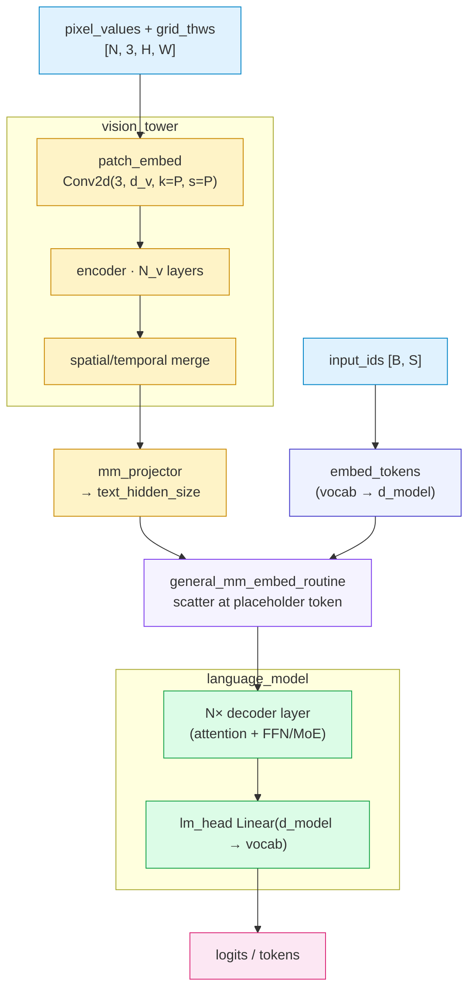
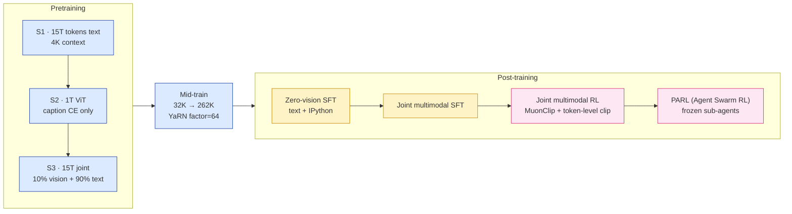
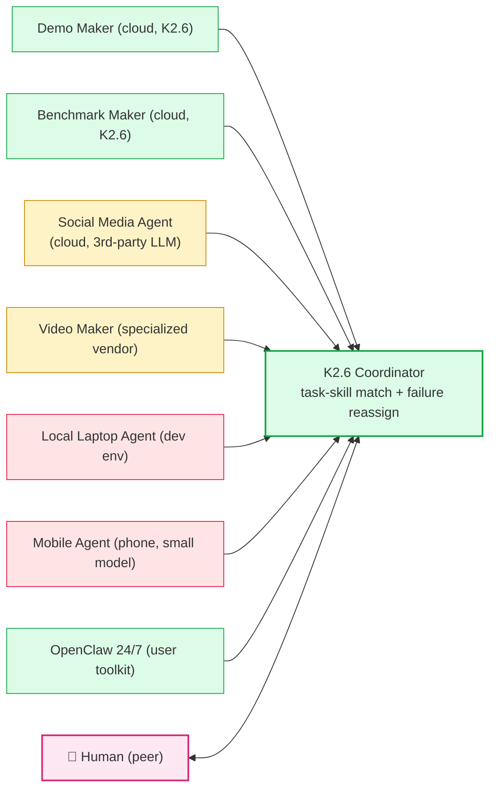
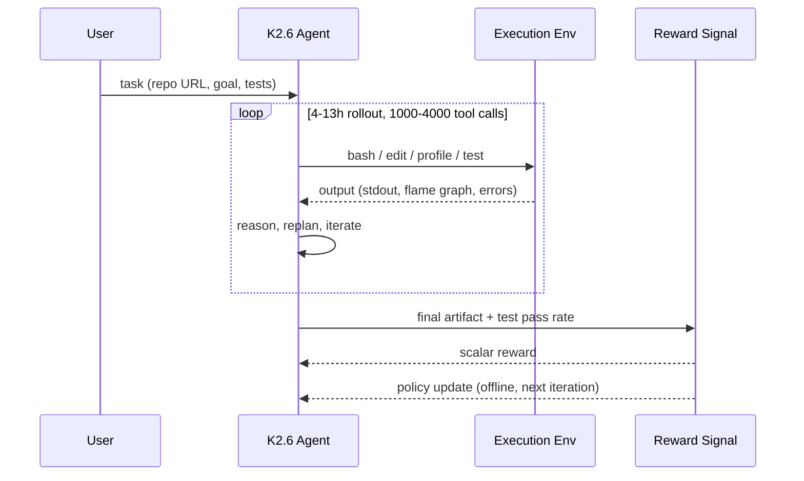
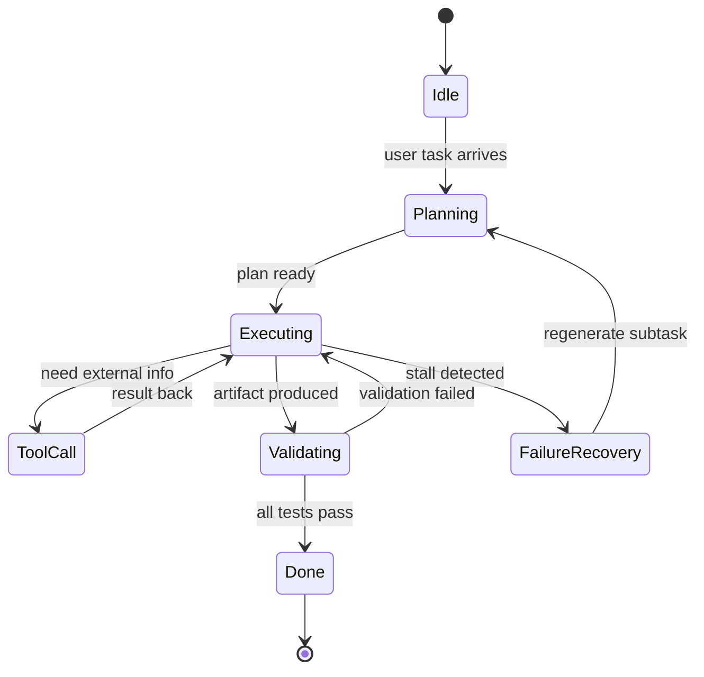

# Diagram Tool Selection (paper-reader helper)

> Created 2026-04-21 after K2.6 turn (see `~/.cursor/paper-db/incidents.md`
> entries 2026-04-21 A/B/D) that exposed three `drawio` failure modes:
> XML handwriting errors, large-file embed render breakage, and cognitive
> cost high enough to drive偷懒 behaviours.
>
> Default tool changes from "drawio ONLY" → **"Mermaid preferred, drawio
> for specific cases, SVG for hero figures"**.

---

## 1. The three tools and when each wins

### Mermaid — DEFAULT for any single-viewpoint diagram

**Why first-line**:

- LLM-friendly DSL (flat text, not nested XML) → generation accuracy very high
- Diff-friendly (line-level changes, not XML reflow)
- Auto-layout (dagre) → no manual x/y math
- Native browser SVG → no viewer bootstrap complexity
- `sync.sh` already wires `mermaid@11` with custom theme since early 2026
- Supports: flowchart, sequenceDiagram, stateDiagram-v2, classDiagram,
  erDiagram, gantt, timeline, mindmap, gitgraph

**Use when**:

- Top-level system / pipeline / data-flow architecture (under ~30 nodes)
- Decoder / encoder block internals expanded to proj-level
- Training pipeline (multi-stage with conditional branches)
- Agent swarm / orchestrator topology / heterogeneous agent layout
- Sequence diagrams (request / tool-call / scheduler traces)
- State machines (agent runtime, VM lifecycle)
- Simple ER / class relationships

### drawio — FALLBACK for specific cases only

**Keep using when**:

- **Multi-page "high→low" ladder** (≥ 3 coordinated views of the same
  system that benefit from `<tab>` switching, e.g. Qwen3-Omni's 7 pages
  top-level + audio + vision + thinker + talker + code predictor + code2wav)
- **Precise-geometry figures**: GPU chip floorplan, SM/CU internal
  floorplan, die shot, memory hierarchy block diagram with proportional
  area
- **Heavy annotation density**: diagrams where many text callouts need
  specific positioning that Mermaid's auto-layout cannot control
- **You already have a pre-existing .drawio** from a predecessor paper
  that you want to fork + annotate (valid backbone-reuse pattern)

**Do NOT use drawio when**:

- Single-viewpoint architecture fits in one view → use Mermaid
- The diagram is ≤ 20 nodes → Mermaid's auto-layout is fine
- You find yourself hand-calculating x/y coordinates → that's a smell,
  Mermaid would have saved you hours

### SVG (hand-drawn) — SPECIFIC use case only

**Use when**:

- **Hero figure** at top of Phase 10 reader (section 1 guide panel)
- **One-off artistic / illustrative diagram** that conveys concept
  (not structure) — e.g. an "intuition sketch" of attention weights as
  heatmap, a pedagogical cartoon of residual flow
- Paper's actual figure is not a real screenshot / plot → SVG redraw
  preserves vector-quality at any zoom

**Not for**: architecture diagrams (→ Mermaid / drawio instead).

---

## 2. Decision matrix

| Scenario | Preferred | Fallback | Never |
|---|---|---|---|
| Top-level pipeline (multimodal input → fuse → LM → output) | Mermaid `flowchart TB` + `subgraph` | drawio single page | ASCII box-art |
| Decoder block internals (MLA Q/KV/attn/o + MoE gate/routed/shared) | Mermaid `flowchart` + nested `subgraph` | drawio | ASCII |
| Vision tower expand (patch_embed → encoder → merge → proj) | Mermaid `flowchart LR` | drawio | SVG |
| Training pipeline (SFT → DPO → GRPO → ...) | Mermaid `flowchart LR` | drawio | — |
| Quantization layout (what's INT4 vs FP16) | Mermaid `flowchart LR` with colour-coded classDef | drawio | — |
| Agent swarm topology (coordinator + N heterogeneous agents) | Mermaid `flowchart` with peer edges | drawio | — |
| Sequence / tool-call trace | Mermaid `sequenceDiagram` | — | — |
| State machine (agent runtime, VM lifecycle) | Mermaid `stateDiagram-v2` | — | — |
| Multi-page high→low ladder (≥ 3 coordinated views) | **drawio (multi-page)** | Mermaid (one diagram per view, linked) | — |
| Chip floorplan / GPU die / physical area | **drawio** | — | Mermaid (no precise geometry) |
| Hero figure / pedagogical cartoon | **SVG (hand-drawn)** | — | — |
| Linear 3-4 step text flow (e.g. `A → B → C`) | Markdown text | — | Any diagram (over-engineering) |
| Data table / benchmark matrix | Markdown table | — | Any diagram |

---

## 3. Mermaid templates library

Copy these as starting points. Each is a proven working pattern from
existing papers or from K2.6 (2026-04-21 retrofit).

### 3a. Top-level multimodal pipeline (K2.6 / Qwen3-Omni-like)

````markdown

````

### 3b. Decoder layer with MLA + MoE (DeepSeek-V3 / Kimi K2 family)

See K2.6 notes §架构 2 for the full version. Key elements:

- `subgraph MLA` containing `QPATH` and `KVPATH` as nested subgraphs
- Separate `classDef` for Q path (blue), KV path (green), RoPE (red),
  attention core (purple)
- `subgraph MOE` with `gate` → `routed` → `combine` ← `shared`
- **Colour-code INT4 vs FP16 at the node level**: use `stroke:#dc2626,stroke-width:2px` for routed experts, green for FP16-kept modules
- Mark KV cache size directly in the KV path output node label

### 3c. Training pipeline (multi-stage recipe)

````markdown

````

### 3d. Agent swarm / orchestrator topology

````markdown

````

### 3e. Sequence diagram (request lifecycle / tool-call loop)

````markdown

````

### 3f. State machine (agent runtime)

````markdown

````

### 3g. Quantization layout (colour-coded what-is-INT4)

See K2.6 notes §架构 4. Key pattern:

- Three subgraphs: `CFG` (config), `INT4_Z` (red border, things
  quantized), `FP16_Z` (green border, things kept FP16)
- `classDef int4 fill:#fee2e2,stroke:#dc2626,stroke-width:3px` for INT4
  region
- `classDef fp16 fill:#dcfce7,stroke:#16a34a` for FP16 region
- Include GB estimates inline in node labels (e.g. `"≈ 925 GB FP16 → 245 GB INT4"`)

---

## 4. Mermaid pitfalls to avoid

(Lessons learned from K2.6 retrofit)

### 4a. HTML entity escaping

- `|` inside a label → escape as `&vert;` or `&#124;` (NOT `&pipe;`,
  which is not a standard entity and will render as literal text)
- `<` and `>` inside labels → use `&lt;` / `&gt;` (inside quoted labels
  only; outside quotes mermaid needs raw `-->`)
- `"` inside labels → escape as `&quot;`, or use single quotes in the label
- `&` inside labels → `&amp;`
- `#` at start of label line → mermaid parses as comment directive, avoid

### 4b. classDef / class application

- Define classDefs at TOP of the diagram (not interleaved)
- Apply with `nodeId:::className` (triple-colon)
- One class per node (multiple classes via `:::a:::b` is supported but fragile)
- Prefer `subgraph` for grouping, classDef for individual node styling

### 4c. subgraph direction

- `subgraph X["Title"]` + `direction TB/LR` on its own line
- Close with `end` (aligned with `subgraph` keyword — indentation
  doesn't matter syntactically but helps readers)
- Nested subgraphs: each needs its own `end`

### 4d. Arrow syntax

- `-->` solid arrow with arrowhead
- `---` plain line
- `-.->` dotted arrow
- `==>` thick arrow
- Label on arrow: `A -->|"label text"| B` or `A --> B` then comment
- Multiple sources to one target: `A & B & C --> D` (ampersand join)

### 4e. HTML labels

- Mermaid supports basic HTML: `<br/>`, `<b>`, `<i>`, `<span>` (limited)
- **NO `<code>`**: renders as literal text. Use backticks is not
  supported either; prefix with \` in bold if needed
- Long labels → break with `<br/>` explicitly
- `htmlLabels: true` already set in sync.sh mermaid.initialize (see
  `DRAWIO_BOOTSTRAP_JS` around line 481)

### 4f. When to split a Mermaid diagram

If a single Mermaid block:
- Has > 30 nodes → consider splitting into 2-3 separate Mermaid blocks
  each covering one sub-system
- Has > 15 edges crossing each other → auto-layout may give messy SVG,
  split by concern
- Has > 8 nested subgraphs → dagre layout can collapse weirdly,
  flatten to 2 levels max

When you need ≥ 3 coordinated views of the same system with tab
switching → that's the drawio use case.

---

## 5. drawio guidance (for the cases where drawio is still right)

### 5a. File naming

- `<paper-id>_arch.drawio` for the primary multi-page architecture
- Additional: `<paper-id>_sched.drawio`, `<paper-id>_cluster.drawio`
  (only if needed)

### 5b. Page organization

- Page 1: top-level overview (same as Mermaid would produce, this
  page overlaps with a Mermaid block — OK, drawio's value is tabs)
- Page 2+: sub-system expansions
- Consider: can each page be a Mermaid block inline in notes and
  reference a drawio back-up? If yes, that's the right layout.

### 5c. Embed in notes

```
{{drawio:<paper-id>_arch.drawio#page=N&height=NNN}}
```

Sync.sh's drawio compactor automatically deduplicates XML when
multiple pages of the same file are embedded.

### 5d. Reader HTML

Use the **lazy-load pattern** (see `SKILL.md` Phase 10 §drawio embed
section). Never use inline `data-mxgraph="{...}"` attribute for drawios
> 10 KB. This is the 2026-04-21B incident.

---

## 6. SVG guidance (for hero figures)

### 6a. When

- Hero figure at top of Phase 10 reader (html-reader-guide.md §Section 1)
- Single illustrative diagram where aesthetic matters more than structure
- Algorithm "intuition sketch" that complements a Mermaid structural diagram

### 6b. How

See `html-reader-guide.md` §Section 5 Fallback option for the full
`viewBox` + roughen filter + Google Fonts style spec.

### 6c. When NOT

- Never use SVG for primary architecture (use Mermaid or drawio)
- Never use SVG to replace missing drawio (use Mermaid instead)
- Never handroll SVG for plots/charts (use matplotlib → PNG)

---

## 7. Retrofit policy (for existing papers)

**Forward-only default**: new papers from 2026-04-21 onwards default to
Mermaid-first per this guide. Existing papers with drawio stay as-is
unless there's a specific reason to refactor.

**Retrofit triggers** (i.e. when to rewrite an existing drawio as Mermaid):

1. User asks for it
2. The paper is being re-read / updated for another reason anyway
3. Completeness checker flags the existing drawio as sub-spec (e.g.
   all pages are release-delta, no arch pages)
4. The drawio is > 80 KB and single-viewpoint → embed issues likely

**Retrofit procedure**:

1. Add Mermaid equivalents inline in notes
2. Keep the .drawio file on disk for history
3. Wrap the drawio embed in `<details>` tag as a "legacy multi-page
   ladder" escape hatch
4. Update §1 references from "drawio Page N" to "架构 N" anchors

K2.6 (2026-04-21) is the reference retrofit.

---

## 8. Enforcement

- `check_paper_completeness.py` accepts **either**: drawio with ≥ 1
  arch page, **or** notes file containing ≥ 1 Mermaid block matching
  arch keywords (flowchart / decoder / encoder / etc.)
- SKILL.md Phase 5 end-of-phase checklist updated accordingly
- deep-llm.md §1.1 updated: Mermaid is the default, drawio is the
  multi-page ladder fallback

When in doubt: **reach for Mermaid first**. You will almost never
regret it.
