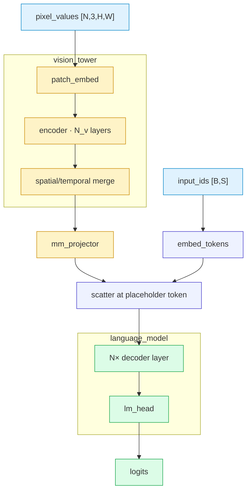
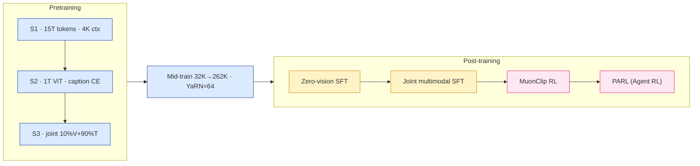
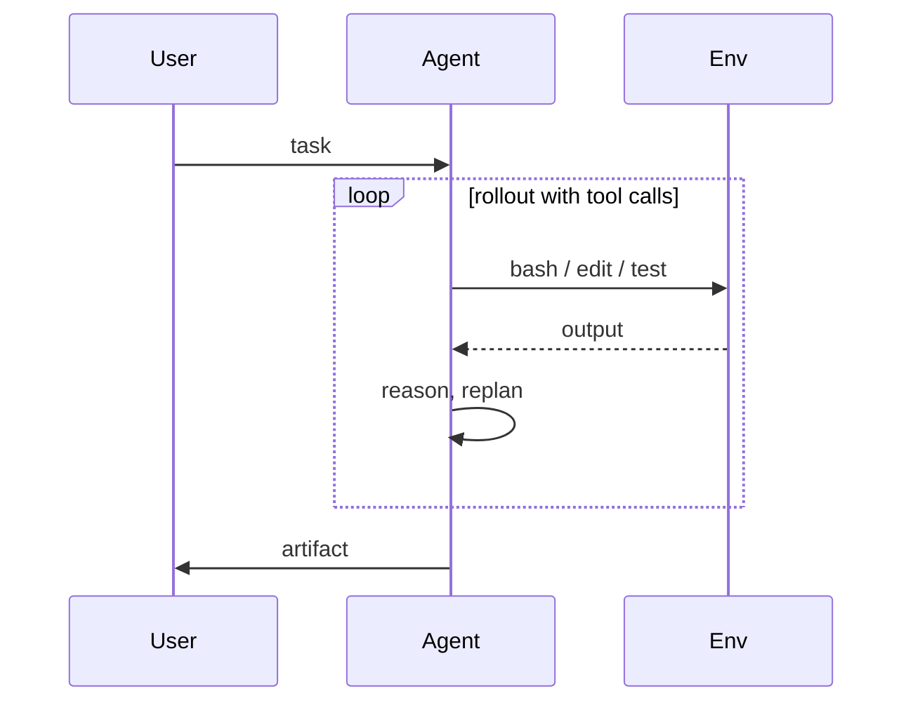
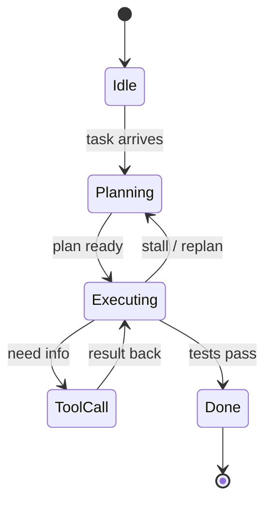

# diagram-tool-choice.md — Mermaid / drawio / SVG decision guide

## Priority 0 — paper's own figure first

**Before choosing a tool**, check whether the paper already has a
figure for what you want to show:

- Paper has a clear figure → **embed the extracted PNG directly**, do
  NOT redraw. Format:
  ```markdown
  
  ```
- Paper's figure is unclear / too abstract / needs extra annotation →
  redraw using the matrix below **AND** state the reason inline (e.g.
  "重画以合并两个视图", "paper 原图分辨率不足", "增加 $t$ 阈值的标注")
- Paper has NO figure for this concept → use the matrix below freely

The redraw is a supplement, not a replacement. When redrawing, keep the
paper's figure nearby as "原图" reference (embed above the redraw or
link in caption).

**Don't redraw just to "use Mermaid"** — duplicated effort, and the
paper's own figure is authoritative source.

## Decision matrix (used when redrawing is justified)

When the paper has no figure, or you've decided a redraw is warranted
per the Priority 0 rule above, pick a tool:

| Scenario | Use |
|---|---|
| Pipeline / data flow / multimodal routing | Mermaid `flowchart TB/LR` + `subgraph` |
| Decoder / encoder block expand (MLA, MoE, attention variants) | Mermaid `flowchart` + nested `subgraph` |
| Training pipeline (multi-stage recipe) | Mermaid `flowchart LR` |
| Quantization layout (INT4 vs FP16) | Mermaid `flowchart` + `classDef` colour coding |
| Agent swarm / orchestrator topology | Mermaid `flowchart` with peer edges |
| Request / tool-call lifecycle | Mermaid `sequenceDiagram` |
| State machine (agent runtime, VM lifecycle) | Mermaid `stateDiagram-v2` |
| ≥3 coordinated views of same system (tab switching) | **drawio multi-page** |
| Chip floorplan / GPU die / physical geometry | **drawio** |
| Hero figure / pedagogical cartoon | **SVG hand-drawn** |
| Linear 3-step text flow (`A → B → C`) | markdown prose |
| Data table / benchmark matrix | markdown table |

**Banned everywhere**: ASCII box art (`┌─ │ ─┐`), code-as-architecture
(pasting `class Foo(nn.Module)` blocks instead of a diagram).

Split Mermaid diagrams with >30 nodes or >15 crossing edges into 2-3
separate blocks by sub-system.

## Mermaid — reusable templates

### Top-level multimodal pipeline

````markdown

````

### Decoder block (MLA + MoE)

Key pattern: `subgraph MLA` containing nested `QPATH` and `KVPATH`
subgraphs; separate `classDef` per path (Q blue, KV green, RoPE red,
attn purple); `subgraph MOE` with `gate → routed → combine ← shared`;
label KV cache size directly in the KV path output node.

### Training pipeline (multi-stage)

````markdown

````

### Sequence (request / tool-call)

````markdown

````

### State machine

````markdown

````

## Mermaid pitfalls

- `|` inside label → `&vert;` or `&#124;`. NEVER `&pipe;` (not a valid entity)
- `<` / `>` → `&lt;` / `&gt;` inside quoted labels
- `"` inside label → `&quot;` or use single quotes
- `&` → `&amp;`
- Define all `classDef` at top, not interleaved
- Apply class: `nodeId:::className` (triple colon)
- `subgraph X["Title"]` with `direction TB/LR` on its own line; each
  subgraph needs its own `end`
- Multiple sources to one target: `A & B & C --> D`
- HTML labels support `<br/>`, `<b>`, `<i>`, `<span>`. NO `<code>`.

## drawio — when Mermaid isn't enough

**Naming**: `<paper-id>_arch.drawio` at
`/apps/feiyue/upstream/zhaifeiyue.github.io/assets/`.

**Embed in notes**:
```
{{drawio:<paper-id>_arch.drawio#page=N&height=NNN}}
```

sync.sh inlines the XML with deduplication. For HTML embed, use the
**lazy-load pattern** (`html-reader-guide.md`) — never inline
`data-mxgraph="{...}"` for drawios > 10 KB.

**Page organization**: Page 1 is top-level overview; pages 2+ are
sub-system expansions. If all content could be Mermaid blocks, drop
the drawio.

## SVG — hero figures only

Hand-drawn SVG for the single hero figure at top of `papers/{id}.html`.
Use `viewBox="0 0 1100 640"`, `feTurbulence` + `feDisplacementMap` for
paper-sketch aesthetic, Google Fonts (IBM Plex Sans + Noto Sans SC) for
labels. Never for primary architecture, never for plots/charts.

## Enforcement

`check_paper_completeness.py` accepts either a `.drawio` file with ≥1
arch page **or** notes containing ≥1 Mermaid block with arch keywords
(`flowchart`, `decoder`, `encoder`, `pipeline`).
