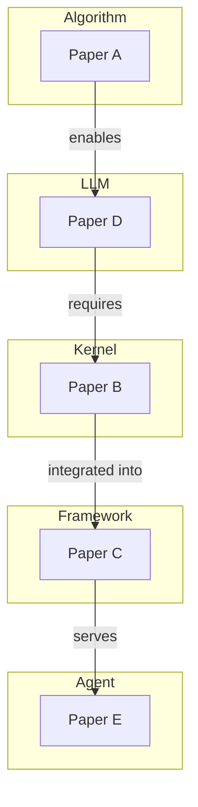

# AI Infra Paper Synthesis

Two operational modes: **Incremental Update** (auto-called after each paper)
and **Full Synthesis** (user-requested comprehensive analysis).

## Data Source

```
~/.cursor/paper-db/
├── papers.json        # Master index — read this first
└── notes/             # Per-paper detailed notes (read as needed)
    └── {paper-id}.md
```

---

## Mode 1: Incremental Update

**Triggered by**: paper-reader skill Phase 8, automatically after every new paper.

This is a fast, focused update — NOT a full report. Execute these steps:

### Step 1: Load Context

Read `~/.cursor/paper-db/papers.json`. Identify the newly added paper (the one
with the most recent `date_read`).

### Step 2: Find Related Papers

For each existing paper in the database, check relatedness to the new paper:

| Signal | Weight |
|--------|--------|
| Same primary category | Medium |
| Shared secondary tags (>=2) | High |
| One paper's `infra_impact` mentions the other's category domain | High |
| Same research thread (cited, follow-up, competitor) | Critical |
| Shared open questions | Medium |

### Step 3: Update Relationships

For every related pair found:

```python
import json, os
DB = os.path.expanduser("~/.cursor/paper-db/papers.json")
with open(DB) as f:
    db = json.load(f)

new_id = "NEW_PAPER_ID"
related_ids = ["RELATED_ID_1", "RELATED_ID_2"]

for paper in db["papers"]:
    if paper["id"] == new_id:
        paper["related_paper_ids"] = list(set(paper.get("related_paper_ids", []) + related_ids))
    elif paper["id"] in related_ids:
        if new_id not in paper.get("related_paper_ids", []):
            paper.setdefault("related_paper_ids", []).append(new_id)

with open(DB, "w") as f:
    json.dump(db, f, indent=2, ensure_ascii=False)
```

### Step 4: Identify Cross-Category Connections

Check if the new paper creates a connection between two categories that
previously had no link. This is especially valuable.

### Step 5: Regenerate HTML

After updating relationships in papers.json:

```bash
python3 ~/.cursor/skills/paper-reader/scripts/generate_html.py
```

This updates the relationship graph in `overview.html` and cross-references
in category pages to reflect the new connections.

### Step 6: Report to User

Output a brief update (NOT a full report):

```markdown
### Synthesis Update

**New paper**: {title} ({category})

**Connections found**: {N} related papers
- [{related_title_1}] ({category}) — {relationship_type}
- [{related_title_2}] ({category}) — {relationship_type}

**New cross-category links**:
- {category_A} ↔ {category_B}: {description}

**Open questions addressed**: {any existing open questions this paper answers}
**New open questions**: {questions this paper raises}
```

---

## Mode 2: Full Synthesis

**Triggered by**: User asks for trend analysis, knowledge map, gap analysis,
or comprehensive review. Also use when the database has grown significantly
since the last full synthesis.

### Procedure

1. Read `~/.cursor/paper-db/papers.json` in full
2. For papers with complex relationships, read their notes files
3. Generate the full report below
4. Save the report to `~/.cursor/paper-db/synthesis-report.md`
5. Regenerate HTML: `python3 ~/.cursor/skills/paper-reader/scripts/generate_html.py`

### Full Report Template

```markdown
# AI Infra Knowledge Synthesis
> Generated: {date} | Total papers: {count}
> Categories: algorithm({n}), kernel({n}), framework({n}), llm({n}), agent({n})

## 1. Category Summaries

### Algorithm ({n} papers)
**Key themes**: ...
**Most impactful**: [{title}]({url}) — {why}
**Open frontier**: ...

### Kernel ({n} papers)
**Key themes**: ...
**Most impactful**: [{title}]({url}) — {why}
**Open frontier**: ...

### Framework ({n} papers)
**Key themes**: ...
**Most impactful**: [{title}]({url}) — {why}
**Open frontier**: ...

### LLM ({n} papers)
**Key themes**: ...
**Most impactful**: [{title}]({url}) — {why}
**Open frontier**: ...

### Agent ({n} papers)
**Key themes**: ...
**Most impactful**: [{title}]({url}) — {why}
**Open frontier**: ...

## 2. Cross-Category Connections

| From Paper | Category | Relationship | To Paper | Category |
|-----------|----------|-------------|----------|----------|
| ... | ... | ... | ... | ... |

### Influence Chains
Multi-hop connections across the stack:
- {Paper} (algo) → {mechanism} → {Paper} (llm) → {mechanism} → {Paper} (agent)

## 3. Stack Impact Map

For each layer, what the collective papers reveal:

| Layer | Key Enablers | Current Bottlenecks | Trend Direction |
|-------|-------------|--------------------|-----------------| 
| Agent | ... | ... | ... |
| LLM | ... | ... | ... |
| Framework | ... | ... | ... |
| Kernel | ... | ... | ... |
| Algorithm | ... | ... | ... |

## 4. Emerging Trends

### Trend 1: {Name}
- **Signal**: {what pattern the papers show}
- **Supporting papers**: [{title}], [{title}], ...
- **Prediction**: {where this is heading}
- **Infra implication**: {what needs to be built}

### Trend 2: {Name}
...

(Identify 3-5 trends)

## 5. Knowledge Gaps

### Under-explored Topics
Categories or sub-topics with < 2 papers.

### Missing Connections
Cross-layer impacts mentioned in infra_impact fields that no paper addresses.

### Unanswered Questions
Aggregated open_questions from all papers, deduplicated and grouped by theme:
- **Theme A**: [question], [question] — from [{paper}], [{paper}]
- **Theme B**: ...

## 6. Recommended Next Reading

Prioritized list of topics or specific papers to read next:
1. {Topic/paper} — fills gap in {area}, connects {cat_A} to {cat_B}
2. {Topic/paper} — addresses open question about {topic}
3. ...
```

### Visualization

When the user asks for a visual, or when the database has >= 5 papers,
include a mermaid diagram:



Adapt to actual papers. Show only the most important connections to keep
the diagram readable (max ~15 edges).

---

## Mode 3: Focused Analysis (User-Specified)

The user may ask focused questions. Map them to the right approach:

| User request | Action |
|-------------|--------|
| "分析 kernel 类别的趋势" | Category deep dive: filter to kernel papers, analyze timeline and themes |
| "FlashAttention 对整个 stack 的影响" | Cross-layer impact trace from one paper |
| "哪些领域还缺论文" | Gap analysis mode |
| "按时间线看趋势" | Timeline analysis: group by quarter, show evolution |
| "这两篇论文什么关系" | Pairwise comparison using both notes files |
